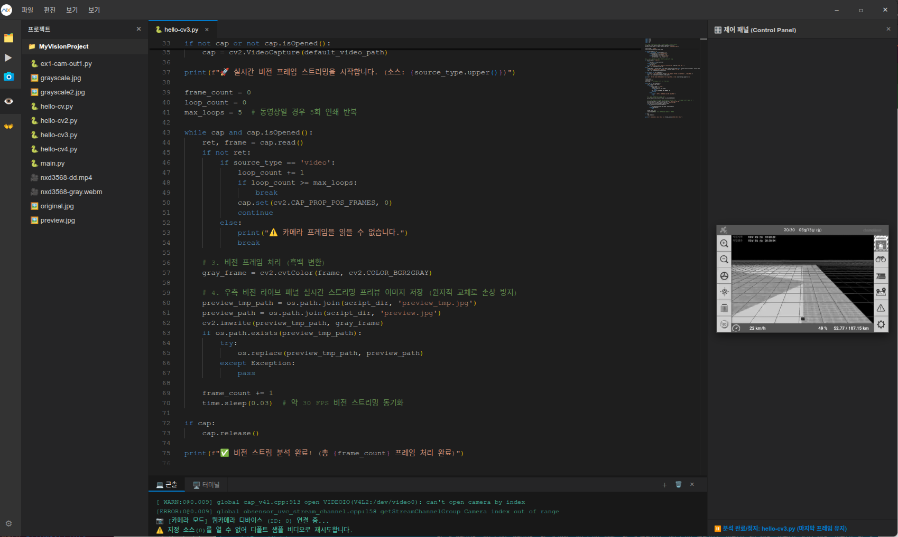

# NexVisionMgr

FPGA & Computer Vision Manager — Electron-based IDE for Python vision analysis.

## 실행결과



## Getting Started

### Clone

```bash
git clone https://github.com/nexfieldsolution/NexVisionMgr.git
cd NexVisionMgr
```

### Install & Run

```bash
npm install
npm start
```

### Push an existing repository

```bash
git remote add origin https://github.com/nexfieldsolution/NexVisionMgr.git
git push -u origin master
```
